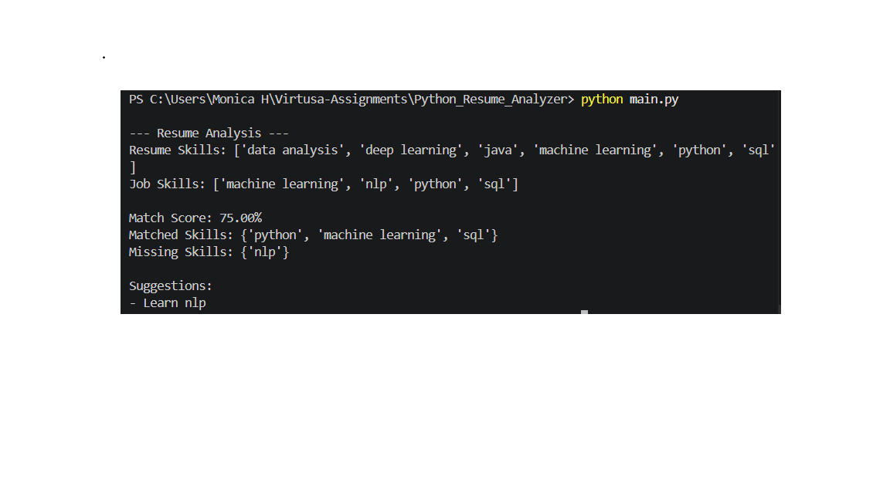
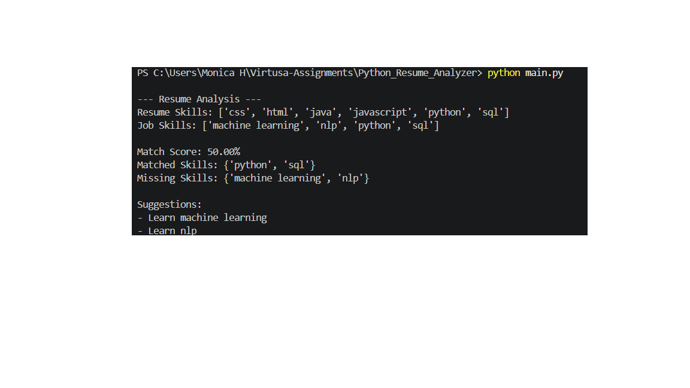

# Resume Analyzer & Job Matcher

## About the Project
This project is a Python-based tool that analyzes a resume and compares it with a given job description. It calculates how well the resume matches the job requirements and also highlights the missing skills.

The main goal of this project is to help freshers understand what skills they need to improve in their resumes.

---

## Features
- Reads resume from PDF 
- Extracts key skills using basic NLP techniques (spaCy)  
- Compares resume skills with job description requirements  
- Calculates a match score (percentage)  
- Identifies missing skills  
- Provides suggestions to improve the resume 

---

## Technologies Used
- Python
- spaCy (for basic NLP)
- pdfminer (for reading PDF) 

---

## Project Structure

Python_Resume_Analyzer/
│── main.py
│── resume_parser.py
│── skill_extractor.py
│── job_matcher.py
│── utils.py
│── sample_data/
│ ├── resume.pdf
│ └── job.txt
├── screenshot1.png 
├── screenshot2.png 
└── README.md

---

## How to Run
1. Install required libraries:

pip install spacy pdfminer.six

python -m spacy download en_core_web_sm

2. Run the program:

python main.py

---

## Sample Output
### Example 1:

### Example 2:

---

## Conclusion
This project demonstrates a basic approach to resume analysis using Python. It acts as a smart assistant that helps users improve their resumes and increases their chances of getting shortlisted. It also highlights the gap between a candidate's skills and job requirements. The project can be further improved by using advanced NLP techniques and better skill extraction methods.

## Author
Monica H
