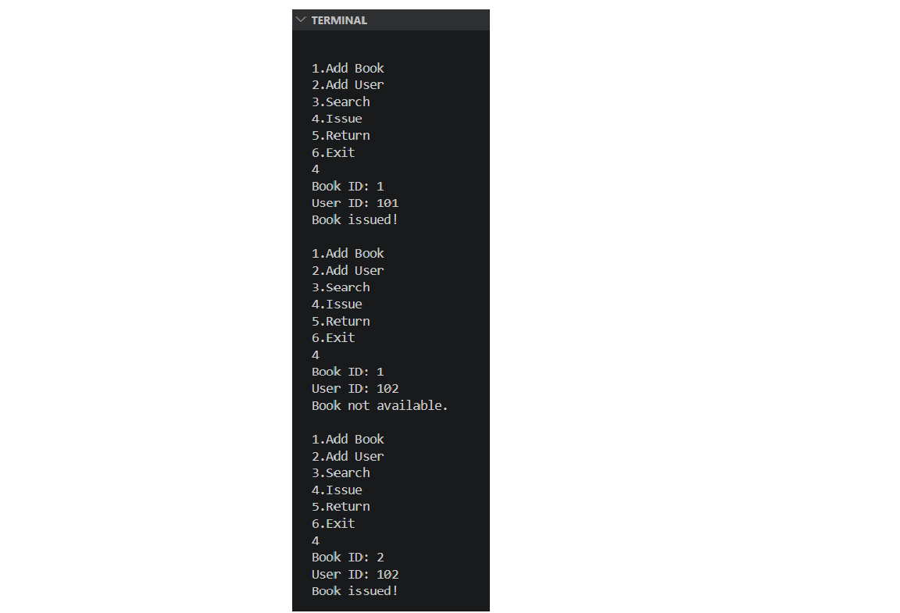
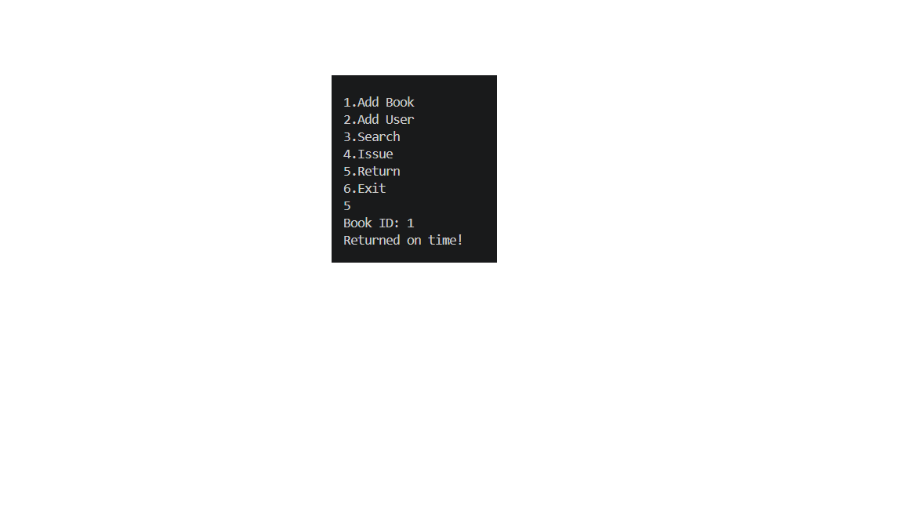
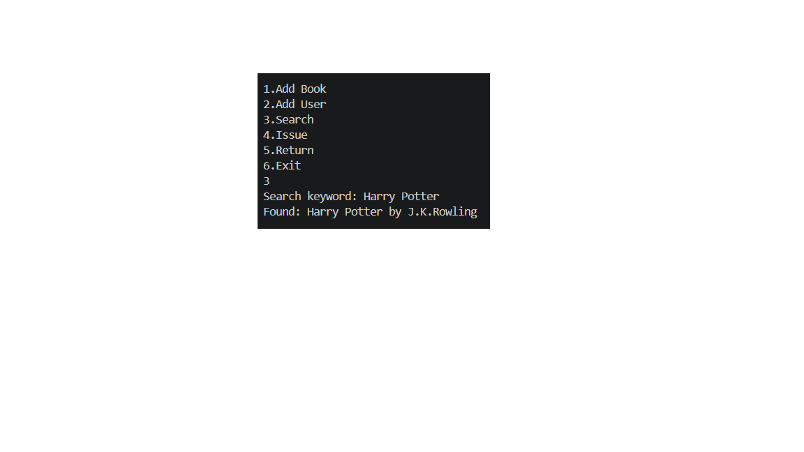

# 📚 Library Management System (Java)

## 🔹 Description

This is a console-based Library Management System developed using Java. It helps manage books, users, and transactions efficiently.

---

## 🔹 Objective
To automate library operations using Java and OOP concepts.

## 🔹 Features

* Add books
* Register users
* Search books (by title/author)
* Issue books
* Return books
* Fine calculation for late returns

---

## 🔹 Technologies Used

* Java (Core Java)
* OOP Concepts
* ArrayList
* Java Time API (LocalDate, ChronoUnit)

---

## 🔹 How to Run

Compile:
javac *.java

Run:
java Main

---

## 🔹 Sample Output

### Add Book

### Add User

### Issue Book

### Return Book

### Fine Calculation

### Search Book

##  Author

Monica H
