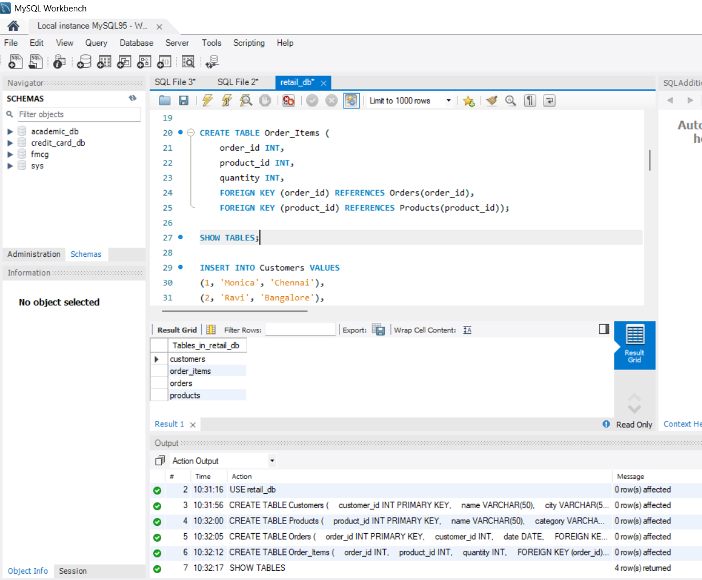
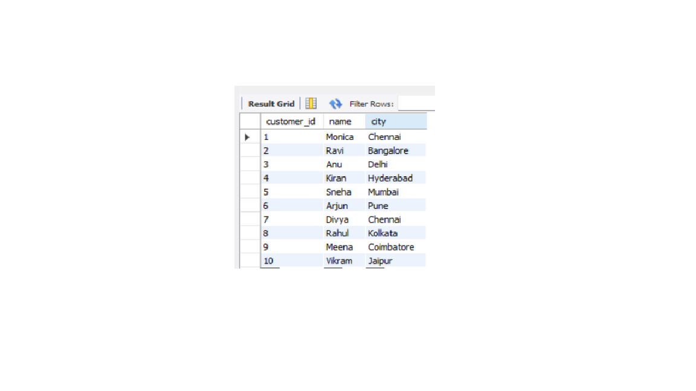
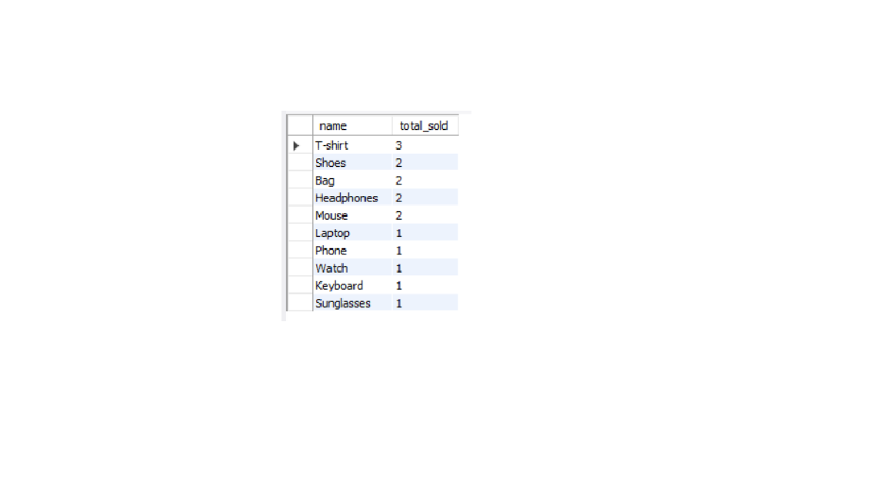
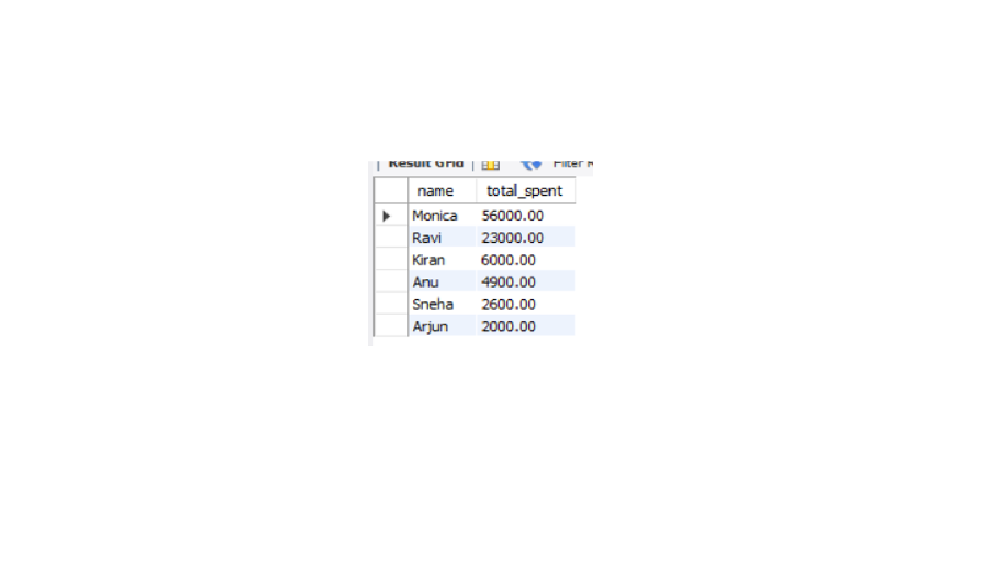
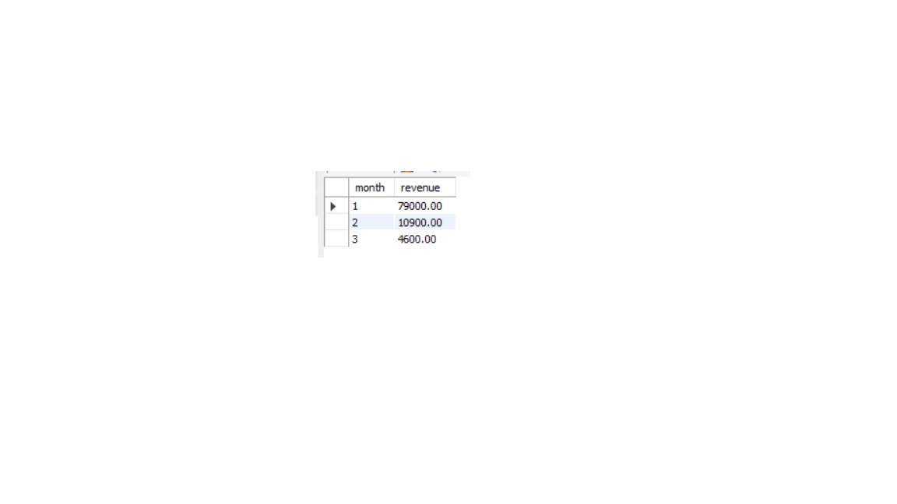
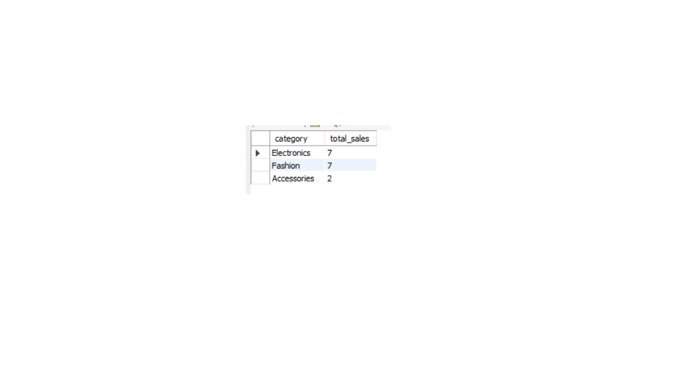
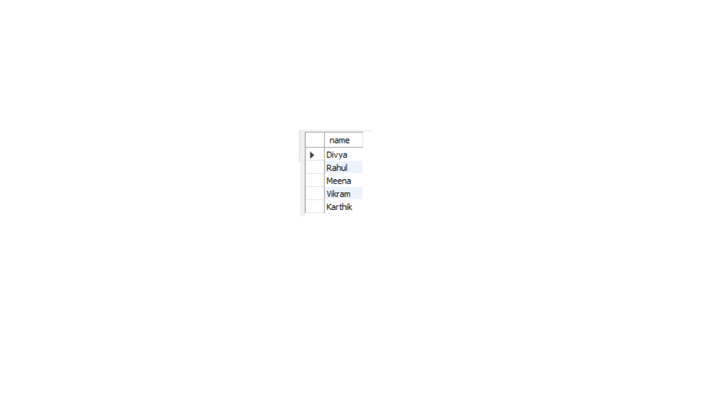

# 🛒 Online Retail Sales Analysis (SQL)

## 📌 Description
This project analyzes retail sales data using SQL queries and relational database design.

---

## 📊 Tables
- Customers
- Products
- Orders
- Order_Items

---

## 🔍 Queries Implemented
- Top-selling products
- Most valuable customers
- Monthly revenue calculation
- Category-wise sales analysis
- Detect inactive customers

---

## 🛠️ Tools Used
- MySQL Workbench
- SQL

---

## ▶️ How to Run
1. Open MySQL Workbench
2. Run `retail.sql`
3. Execute queries

---

## 📁 Project Structure

- retail.sql → Contains all SQL queries
- Images → Sample outputs of queries

## 📸 Sample Output

### Tables Created

### Sample Data

---

### Top Selling Products

### Most Valuable Customers

### Monthly Revenue

### Category-wise Sales

### Inactive Customers

## 👩‍💻 Author
Monica H
